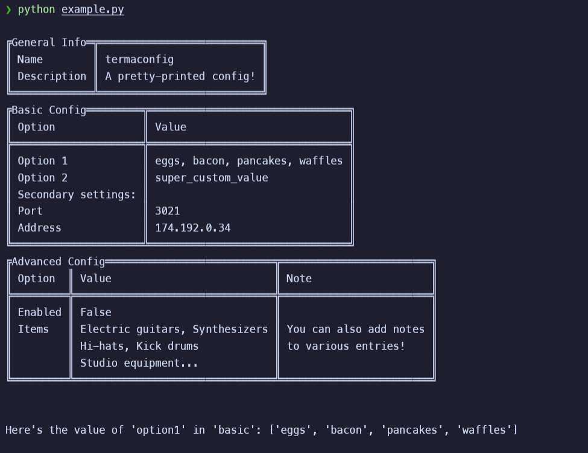

## What is *TermaConfig*

TermaConfig started as an idea to have a prettier, more dynamic way of displaying configuration content to users. It started as a (lackluster) system of printing out info in a more data-driven manor, then, as many projects do, expanded in scope and ended up becoming its own branching project.



## Installation

ZenConfig is available as a pip package (`pip install termaconfig`), or whatever other cool thing you're using to manage Python packages.

## Usage

There are two different approaches to using this library depending on how granular you want to go (or technically three, if you're really creative). The first is to use the all-in-one wrapper class for the `ConfigObj` library for handling config loading and validation. Low flexibility, but extremely simple to use.

The second option is to implement your own wrapper, which is also fairly straightforward. Check the `__init__.py` code in the `TermaConfig` class for some ideas, especially if you want to take the same approach of extending `ConfigObj`.

ZenConfig is built against ConfigObj and its spec, though it just opperates entirely with dicts under the hood, so it should (in theory) work with built-in tomllib or configparser to some degree. I may also add support for other libraries as well at some point.

### Metakey format

*"Metakeys"* define how tables are shown. They are extra entries inside a config specification that contain a special delimiter, double underscore (`__`) by default. You can append each config option with the delimiter followed by a parameter (eg `option__title = "Pretty name"`), though by far the most useful options are ones that apply to entire sections, which open with the delimiter string.

There are a bunch of different options to mix and match and create well-formatted tables with, all of which can be reviewed by downloading the `example-spec.toml` file provided with the example script. Here's a copy of it:

```
Section options:
__title (str): Name of the table that will be printed. Also used intuitively by
   other options like __type.
__header (list): Adds a header. Should contain up to 3 list items for column names.
__type (str): How the entries in the section are interpreted:
  variable: Searches the config section for values to show instead.
  list_keys: Merges all config keys into one entry.
  list_values: Merges all values from associated config to one entry.
  list_all: Merges both keys and values: 'key1 (value1), key2, (value2)'
__wrap (int): (__type only) Wraps value entries every provided number of items.
__parent (section): dot notated path of another section to merge the table into.
__ignore (bool): Whether to completely ignore handling tables for the section.
__toggle (str): Point to any boolean option in a dot-notated path that
  acts as __ignore if false.

Per-item options:
{option}__title (str): Pretty name to use in place of the technical one.
{option}__note (str): Optional third column entry.
{option}__ignore (str): Same as for sections but per-option.
```

### (Very) Basic Code Example

```python
from zenconfig import TermaConfig, ConfigValidationError

# Can be paths or file-like objects
if __name__ == '__main__':
    config_path = 'example-config.toml'
    spec_path = 'example-spec.toml'

    try:
        config = TermaConfig(
            config_path,
            spec_path,
        )
    except ConfigValidationError:
        print()
        print("Errors are present in configuration. Exiting...")
        exit()
```

A slightly more complete version is present in `example.py`, as well as the example TOMLs used.

## Components

- **TermaConfig**: The main class that wraps ConfigObj with the prettification of TermaConfig. Super easy to use and should fit most usecases.
- **ConfigParser**: Parses a configuration, specification and validation results into a dense `metaconf` dictionary.
- **ConfigTables**: Generates a nice table of configuration sections based on special keys defined in your spec. Customizable with any `terminaltables3` class!
- **ErrorTree**: Constructs a tree-like representation of validation errors using `printree` or any other library that works with dict hierarchies, because issues should be human-readable.

Also, if you want to get real nitty-gritty with customization, there are some useful functions in `termaconfig.utils` worth checking out.

## Exceptions

- **ConfigValidationError**: Raised by `TermaConfig` when a configuration failed validation.
- **TableTypeError**: Raised by `ConfigTables` when a provided `terminaltables3` class is invalid.

## Other Stuff

- Share cool stuff or ask questions over on [Discord](https://discord.gg/wnzGNuxBVd)
- Contributions are welcome. Please report any issues you come across!
- Sub-project of [Respackr](https://github.com/Zentheon/respackr)
- Licensed under GPLv3
